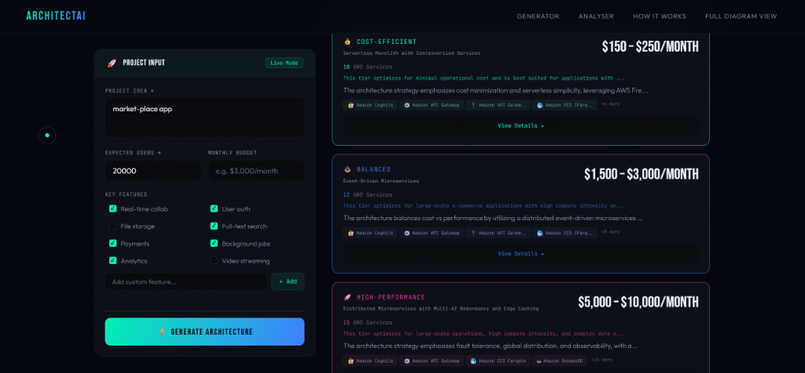
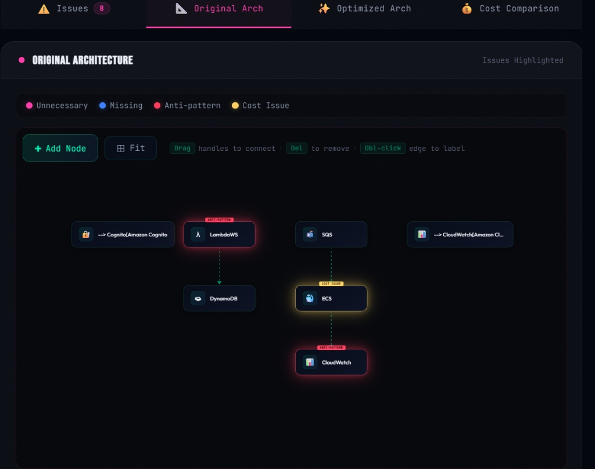
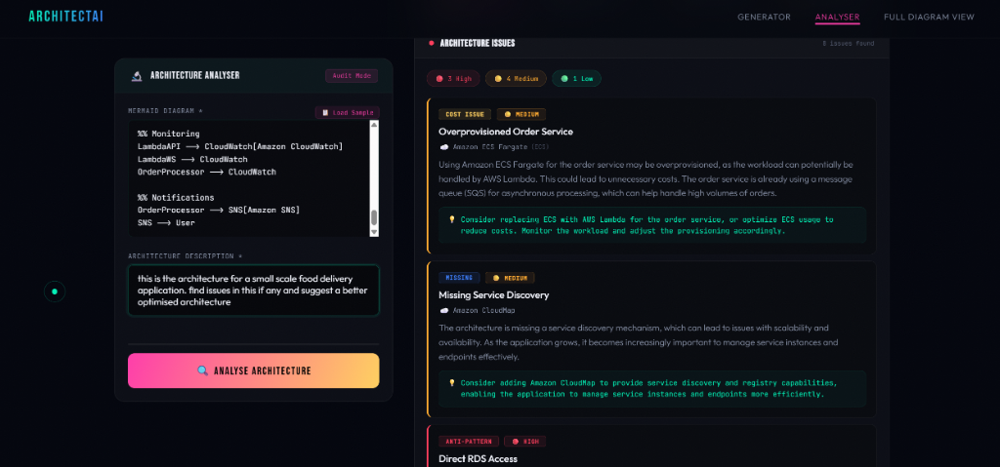
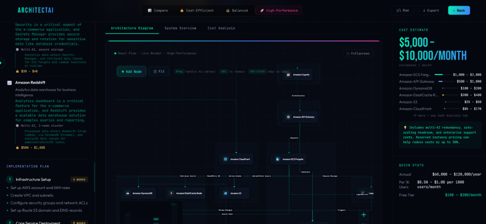
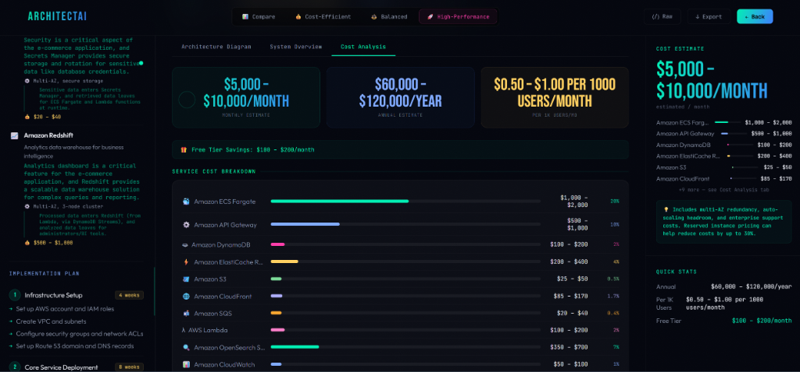

<div align="center">
  
  
  
  
  
  <h1>🌟 ArchitectAI 🌟</h1>
  <h3>RAG-Grounded Multi-LLM Cloud Infrastructure Agent</h3>
  <p>Transforming natural language requirements into production-ready, grounded AWS architectures.</p>
</div>

---
*(Note: This is an active personal maintenance repository. The original hackathon repository is linked here: [Original Repository](https://github.com/Adrish-alias/Architect_Ai))*

## 🚀 Overview

**ArchitectAI** is a generative AI assistant designed to act as your automated Solutions Architect. It bridges the gap between high-level business goals and technical cloud implementations by transforming natural language descriptions into comprehensive, multi-tiered AWS architectures grounded in real-world AWS Reference Architectures.

### 💡 Why ArchitectAI?
Designing enterprise-grade cloud infrastructure traditionally requires deep domain expertise and manual diagramming. ArchitectAI delivers:
- **Instant Productivity**: Move from idea to full architecture in seconds.
- **RAG Reference Grounding**: Ground decisions in curated AWS Reference Architectures via local vector search.
- **Traceable Architectural Decisions**: Clear distinction between `RETRIEVED_GROUNDED` decisions (with verified source reference IDs) and model-derived decisions.
- **Automated Consistency Validation**: Built-in self-healing validator loop that catches graph inconsistencies and un-triggered queue connections before deployment.
- **Live React Flow Interaction**: Trace, zoom, and inspect your infrastructure graph in real-time.
- **Deep Auditing**: Automatically detect anti-patterns and over-provisioned services before deployment.

---

## ✨ Key Features & Visuals

### 1. Requirement Classification & Infrastructure Tiering
<p align="center">
  
</p>
Input your project idea, user scale, budget, and key features. ArchitectAI intelligently classifies your requirements to provision three distinct infrastructure tiers: **Cost-Optimized**, **Balanced**, and **High-Performance**.

### 2. Deep Architecture Analysis & Error Detection
<p align="center">
  
</p>
<p align="center">
  
</p>
The intelligent Analyser actively audits existing architectures. It visually tags nodes on the graph and extracts actionable recommendations—such as detecting over-provisioned services (Cost Issues), missing service discovery, and architectural anti-patterns.

### 3. Interactive React Flow Diagrams
<p align="center">
  
</p>
Experience your cloud infrastructure through fully interactive, zoomable, and editable node-based graphs. Trace component connections between Amazon Cognito, API Gateway, AWS Lambda, ECS Fargate, and DynamoDB.

### 4. Cost Estimation & Implementation Planning
<p align="center">
  
</p>
Get monthly and annual financial projections calibrated to your workload size. Break down expenditures service-by-service and receive a phase-by-phase Implementation Roadmap to guide deployment.

---

## 🧠 The Multi-LLM & RAG Pipeline

ArchitectAI relies on a multi-stage **Local RAG & Multi-LLM orchestration** strategy:

1. **Requirement Classification (Meta Llama 3-70B)**: Maps scale, compute intensity, data complexity, and real-time operational needs.
2. **Local Vector RAG Retrieval (`all-MiniLM-L6-v2`)**: Searches local vector index for relevant AWS Reference Architectures based on requirement profiles and coverage scoring.
3. **Reference Analysis & Decision Grounding**: Evaluates matched patterns, extracts architectural decisions, and determines Grounding Strength (`STRONG` / `MODERATE`).
4. **Guardrail Service Selection (Meta Llama 3-70B)**: Maps requirements and reference evidence to optimal AWS services without rigid hardcoded overrides.
5. **JSON Assembly & Mermaid Diagram Generation**: Builds structured architecture JSON and converts components into clean Mermaid graph representations.
6. **Consistency Validation & Self-Healing Loop**: Runs an automated 2-attempt LLM correction retry loop to resolve graph or queue connection inconsistencies.
7. **Senior Architectural Pass (Google Gemini 2.5 Flash)**: Final pass to sanity-check security boundaries, data flows, and cost estimates.

---

## 🛠️ Technology Stack

| Domain | Technologies |
| :--- | :--- |
| **Frontend** | React 19, Vite, React Flow, React Router DOM, Vanilla CSS |
| **Backend** | Node.js, Express.js (Modular Architecture) |
| **Local RAG & Embeddings** | `@xenova/transformers` (`all-MiniLM-L6-v2`), ONNX Runtime WASM, Local Vector Store |
| **AI / LLMs** | Amazon Bedrock (Meta Llama 3-70B), Google Gemini 2.5 Flash |

---

## 📂 Repository Structure

```text
ArchitectAI/
├── backend/                              # Express.js Server & LLM Orchestration
│   ├── .env                              # Environment variables (Bedrock & Gemini Keys)
│   ├── .env.example                      # Environment variables template
│   ├── package.json                      # Server dependencies & scripts
│   ├── data/                             # Knowledge base records & persistent RAG index
│   ├── scripts/                          # RAG indexing, testing & evaluation utilities
│   └── src/                              # Modular backend codebase
│       ├── server.js                     # HTTP server entry point
│       ├── app.js                        # Express app configuration & middleware
│       ├── routes/                       # Architecture & Analysis API endpoints
│       ├── controllers/                  # HTTP request handling
│       ├── services/                     # Generation, Analysis, Validator, LLM & Mermaid services
│       ├── rag/                          # Local RAG engine (embedder, loader, retrieval, reference-analyzer)
│       ├── config/                       # Environment configuration & RAG thresholds
│       └── prompts/                      # Multi-LLM prompt templates
│
├── frontend/                             # React Client-side Application
│   └── react-app/
│       ├── src/                          # React components & React Flow hooks
│       ├── public/                       # Static assets
│       ├── index.html                    # App entry point
│       └── vite.config.js                # Vite configuration
├── assets/                               # Application screenshots
└── README.md                             # Project documentation
```

---

## ⚙️ Quick Start Installation

Follow these instructions to get ArchitectAI running in your local environment.

### 1. Prerequisites
Ensure you have Node.js installed, then create a `.env` file in the `backend` directory containing your credentials:
```env
GEMINI_API_KEY=your_gemini_key_here
AWS_BEARER_TOKEN_BEDROCK=your_bedrock_token_here
RAG_ENABLED=true
RAG_RELEVANCE_THRESHOLD=0.45
```

### 2. Clone the Repository
```bash
git clone https://github.com/Adrish-alias/Architect-AI.git
cd Architect-AI
```

### 3. Build Vector Index & Start Backend Server
```bash
cd backend
npm install

# Build/verify the local RAG vector index
npm run rag:index

# Start backend server
npm start
```

### 4. Start the Frontend App
Open a new terminal window:
```bash
cd frontend/react-app
npm install
npm run dev
```

The application will launch on your local host (usually `http://localhost:5173`).

---

## 🔮 Future Roadmap

- [ ] **Infrastructure as Code (IaC) Export**: One-click generation of production-ready Terraform modules and AWS CDK constructs.
- [ ] **Live Price Aggregation**: Integration with the official AWS Pricing API for dynamically shifting cost insights.
- [ ] **Multi-Cloud Equivalency**: Expanded ontology maps to generate matching Google Cloud Platform (GCP) and Microsoft Azure layouts.
- [ ] **Security Auditing**: Strict compliance scanning against the AWS Well-Architected Framework guidelines.

---

## 🤝 Core Contributors

Crafted with passion by the ArchitectAI Team:
- [**Adrish Chatterjee**](https://github.com/Adrish-alias)
- [**Ansh Singh**](https://github.com/AnshSingh-2024)
- [**Nakshtra Agrawal**](https://github.com/nakshtraagrawal)
- [**Pratyush Parashar**](https://github.com/pratyuxxhh)

---

<div align="center">
  <p>Built under the <b>MIT License</b>.</p>
</div>
