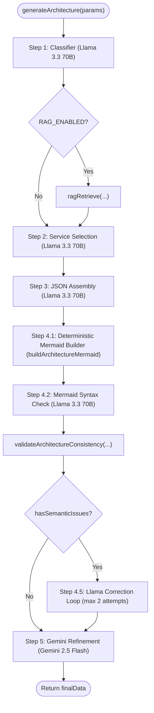
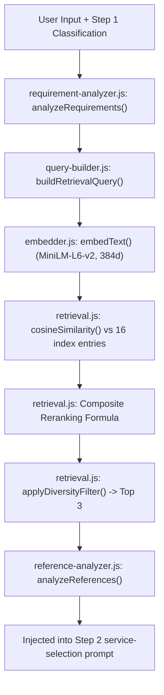

# ArchitectAI Project Pipeline Report: Complete Backend Architecture & Generation Audit

**Document Status:** Complete & Verified Code Audit  
**Date:** September 7, 2026  
**Scope:** Backend Architecture Generation Pipeline (`POST /generate`), Knowledge Base, RAG System, Prompts, Validators, Cost Model, and Frontend Contract.  
**Constraint Compliance:** Zero code modifications made. Audited purely through static analysis, runtime call-chain inspection, and code trace.

---

## 1. Executive Summary

ArchitectAI is an AI-assisted cloud architecture generation engine that translates natural language system requirements into a structured, single AWS architecture design accompanied by a visual topology diagram (Mermaid.js rendered via React Flow) and cost projections.

### High-Level End-to-End Pipeline Flow

```
User NLP Input (idea, users, budget, features)
  │
  ▼
[1] HTTP Controller: architecture.controller.js (POST /generate)
  │   └── Validates payload presence (idea, users); passes to service.
  ▼
[2] Architecture Orchestrator: architecture.service.js (generateArchitecture)
  │
  ├───► Step 1: Scale & Complexity Classifier [LLM: Llama 3.3 70B on Bedrock]
  │       └── Classifies workload into SCALE, COMPUTE_INTENSITY, DATA_COMPLEXITY, REALTIME_NEEDS.
  │
  ├───► RAG Retrieval & Reference Grounding [Local Embeddings + Vector Store + LLM]
  │       ├── 1.1 Requirement Analyzer [LLM: Llama 3.3 70B]: Generates JSON Requirement Profile.
  │       ├── 1.2 Query Builder [Deterministic]: Assembles domain + profile query string.
  │       ├── 1.3 Vector Embedding [Deterministic/Local]: Xenova/all-MiniLM-L6-v2 (384-dim).
  │       ├── 1.4 Vector Search [Deterministic/Local]: Cosine similarity over 16 JSONL records.
  │       ├── 1.5 Composite Reranking [Deterministic]: 0.50 semantic + 0.25 coverage + 0.15 category + 0.10 signals.
  │       ├── 1.6 Diversity Filtering [Deterministic]: Picks primary match + complementary categories.
  │       └── 1.7 Reference Analyzer [Deterministic]: Classifies decisions into RETRIEVED_GROUNDED vs LLM_DERIVED.
  │
  ├───► Step 2: Service Selection & Topology Planning [LLM: Llama 3.3 70B on Bedrock]
  │       └── Injected with RAG evidence; outputs Architecture Strategy, Grounded Decisions,
  │           authoritative "## Architecture Topology" connections, and Selected AWS Services.
  │
  ├───► Step 3: Architecture JSON Assembly [LLM: Llama 3.3 70B on Bedrock]
  │       └── Assembles strict JSON schema: scale_analysis, architecture_overview (with topology_edges),
  │           aws_services, cost_breakdown, implementation_steps.
  │       └── Safe Parse + Truncation Recovery (json.service.js).
  │
  ├───► Step 4: Mermaid Diagram Construction & Syntax Validation
  │       ├── 4.1 Deterministic Graph Builder [mermaid.service.js: buildArchitectureMermaid]:
  │       │       Uses Step 3 `topology_edges` as primary graph skeleton; maps nodes & subgraphs.
  │       │       Fallback to hardcoded service-presence template edges if topology_edges is empty.
  │       ├── 4.2 LLM Syntax Validator [LLM: Llama 3.3 70B on Bedrock]: Validates Mermaid syntax only.
  │       └── 4.3 Fallback Sanitizer: If LLM output fails syntax, reverts to pre-built diagram.
  │
  ├───► Architecture Consistency Validation & Correction Loop [Hybrid Deterministic + LLM]
  │       ├── Validator [validator.service.js: validateArchitectureConsistency]:
  │       │   Evaluates structural syntax, service-to-diagram presence, producer/consumer balance (SQS/Kinesis),
  │       │   ingress path logic, and justification anti-patterns.
  │       └── Correction Pass [LLM: Llama 3.3 70B on Bedrock]: If semantic issues exist, loops up to 2 times
  │           with architecture-correction.prompt.js. If still failing, sets status = "NEEDS_REVIEW".
  │
  ├───► Step 5: Final Validation & Refinement [LLM: Google Gemini 2.5 Flash]
  │       └── Evaluates complete architecture JSON: validates Mermaid syntax, enforces service consistency,
  │           sanity checks costs, checks flow logic (e.g. ElastiCache not direct to DynamoDB).
  │       └── Fallback: If Gemini API fails, pipeline gracefully catches and keeps Step 4 output.
  │
  ▼
[3] Final API Response: HTTP 200 { success: true, architecture: finalData }
  │
  ▼
[4] Frontend: React App (localStorage -> ResultPage.jsx -> ArchitectureDiagram.jsx -> React Flow)
```

### Stage Classification Matrix

| Stage | Mechanism | Engine / Dependency | Modifies Output? |
|---|---|---|---|
| **Request Validation** | Deterministic Code | Express 5 controller | No |
| **Step 1 Classification** | Probabilistic LLM | Meta Llama 3.3 70B (`AWS Bedrock`) | N/A (generates text) |
| **RAG: Requirement Profile** | Probabilistic LLM / Heuristic Fallback | Meta Llama 3.3 70B (`AWS Bedrock`) | Parsed via `safeParse` |
| **RAG: Query Building** | Deterministic Code | `src/rag/query-builder.js` | N/A |
| **RAG: Embedding** | Deterministic Local ONNX | `@xenova/transformers` (`all-MiniLM-L6-v2`) | Embeds query into 384 floats |
| **RAG: Vector Search & Reranking** | Deterministic Code | `src/rag/retrieval.js` (Cosine + Heuristic weights) | Produces ranked top-3 references |
| **RAG: Reference Grounding** | Deterministic Rule Matching | `src/rag/reference-analyzer.js` | Emits grounded vs LLM-derived lists |
| **Step 2 Service Selection** | Probabilistic LLM | Meta Llama 3.3 70B (`AWS Bedrock`) | N/A (generates text) |
| **Step 3 JSON Assembly** | Probabilistic LLM | Meta Llama 3.3 70B (`AWS Bedrock`) | Parsed via `safeParse` / `attemptJsonRecovery` |
| **Step 4.1 Mermaid Builder** | Deterministic Code | `src/services/mermaid.service.js` | Builds raw Mermaid from `topology_edges` |
| **Step 4.2 Mermaid Validation** | Probabilistic LLM | Meta Llama 3.3 70B (`AWS Bedrock`) | Sanitized; fallback to pre-built if malformed |
| **Consistency Validation** | Deterministic Heuristics | `src/services/validator.service.js` | Strips markdown fences, normalizes CRLF |
| **Correction Loop (Optional)** | Probabilistic LLM (0-2 passes) | Meta Llama 3.3 70B (`AWS Bedrock`) | Re-parsed and re-validated |
| **Step 5 Refinement** | Probabilistic LLM | Google Gemini 2.5 Flash (`@google/generative-ai`) | Replaces JSON; fallback to Step 4 on error |
| **Cost Estimation** | Pure LLM Generation | Llama 3.3 (Step 3) & Gemini (Step 5) | No AWS Pricing API integration |

---

## 2. Actual `/generate` Request Flow

Runtime execution follows a single linear pipeline orchestrated by `backend/src/services/architecture.service.js`:

```
POST http://localhost:5000/generate
 │  Headers: { "Content-Type": "application/json" }
 │  Body: { "idea": "...", "users": "10000", "budget": "$2000", "features": [...] }
 │
 ├──► File: backend/src/app.js
 │    Routes: app.use("/generate", architectureRoutes)
 │
 ├──► File: backend/src/routes/architecture.routes.js
 │    Handler: router.post("/", generate)
 │
 ├──► File: backend/src/controllers/architecture.controller.js
 │    Function: generate(req, res)
 │    Action: Validates presence of `idea` and `users`.
 │    Delegates: const finalData = await generateArchitecture({ idea, users, budget, features })
 │
 ├──► File: backend/src/services/architecture.service.js
 │    Function: generateArchitecture({ idea, users, budget, features })
 │    │
 │    ├── 1. Step 1: Scale & Complexity Classifier
 │    │      Calls: callLlama(step1System, step1User, 300)
 │    │      Prompts: buildClassificationSystemPrompt(), buildClassificationUserPrompt()
 │    │      Output: 4-line text (SCALE, COMPUTE_INTENSITY, DATA_COMPLEXITY, REALTIME_NEEDS)
 │    │
 │    ├── 2. RAG Retrieval Pipeline (if RAG_ENABLED === true)
 │    │      Calls: ragRetrieve({ idea, users, budget, features, classificationText: analysis })
 │    │      File: backend/src/rag/rag-service.js
 │    │      │
 │    │      ├── 2.1 analyzeRequirements(...) [backend/src/rag/requirement-analyzer.js]
 │    │      │       Calls: callLlama(SYSTEM_PROMPT, userPrompt, 800)
 │    │      │       Output: Structured Architecture Requirement Profile JSON
 │    │      │
 │    │      ├── 2.2 buildRetrievalQuery(...) [backend/src/rag/query-builder.js]
 │    │      │       Output: Natural language retrieval query string
 │    │      │
 │    │      ├── 2.3 retrieveArchitectures(...) [backend/src/rag/retrieval.js]
 │    │      │       Calls: embedText(query) [backend/src/rag/embedder.js] -> 384-dim vector
 │    │      │       Loads: loadIndex() [backend/src/rag/vector-store.js] (16 entries)
 │    │      │       Calculates: cosineSimilarity + composite reranking weights
 │    │      │       Filters: applyDiversityFilter(...)
 │    │      │       Output: Array of top-3 architecture records with scores
 │    │      │
 │    │      └── 2.4 analyzeReferences(...) [backend/src/rag/reference-analyzer.js]
 │    │              Evaluates retrieved records against profile requirements
 │    │              Output: { groundedDecisions, llmDerivedDecisions, topScore, groundingStrength }
 │    │
 │    ├── 3. Step 2: Service Selection & Strategy
 │    │      Calls: callLlama(step2System, step2User, 1500)
 │    │      Prompts: buildServiceSelectionSystemPrompt(), buildServiceSelectionUserPrompt()
 │    │      Input: classification, user input, and `<aws_reference_architectures>` block
 │    │      Output: Plain text with `## Architecture Strategy`, `## Architectural Decisions & Grounding`,
 │    │              `## Architecture Topology`, and `## Selected AWS Services`
 │    │
 │    ├── 4. Step 3: JSON Assembly
 │    │      Calls: callLlama(step3System, step3User, 3500)
 │    │      Prompts: buildArchitectureJsonSystemPrompt(), buildArchitectureJsonUserPrompt()
 │    │      Input: Step 1 analysis + Step 2 serviceStack
 │    │      Parsing: safeParse(jsonRaw) || attemptJsonRecovery(jsonRaw)
 │    │      Error: Throws status 500 error if JSON completely unrecoverable
 │    │      Defaulting: Ensures aws_services, architecture_overview, topology_edges, cost_breakdown exist
 │    │
 │    ├── 5. Step 4: Mermaid Diagram Construction
 │    │      Calls: buildArchitectureMermaid(parsed) [backend/src/services/mermaid.service.js]
 │    │             Iterates over parsed.architecture_overview.topology_edges; maps nodes/subgraphs.
 │    │      Calls: callLlama(step4System, step4User, 1200) [backend/src/prompts/generation/mermaid-validation.prompt.js]
 │    │      Sanitizes: sanitizeMermaid(rawMermaid)
 │    │      Fallback: If output doesn't start with "graph", reverts to sanitizeMermaid(preBuildDiagram)
 │    │
 │    ├── 6. Architecture Consistency Validation & Correction Loop
 │    │      Calls: validateArchitectureConsistency(parsed) [backend/src/services/validator.service.js]
 │    │      Condition: If validationReport.hasSemanticIssues === true:
 │    │      Loop: Up to MAX_CORRECTION_ATTEMPTS (2)
 │    │            Calls: callLlama(corrSystem, corrUser, 3500)
 │    │                   [backend/src/prompts/generation/architecture-correction.prompt.js]
 │    │            Re-parses, re-sanitizes Mermaid, re-validates.
 │    │      Status: Sets parsed.validation_status = "PASS" or "NEEDS_REVIEW"
 │    │
 │    └── 7. Step 5: Gemini Validation & Refinement
 │           Calls: refineArchitecture(parsed) [backend/src/services/gemini.service.js]
 │           Model: gemini-2.5-flash
 │           Try/Catch: On Gemini failure/timeout, catches error and returns Step 4 parsed object!
 │           Attaches: validation_status and validation_report
 │
 └──► Controller returns HTTP 200:
      res.json({ success: true, architecture: finalData })
```

---

## 3. Controller Audit

* **File:** `backend/src/controllers/architecture.controller.js`
* **Route:** `POST /generate` defined in `backend/src/routes/architecture.routes.js`, mounted at `/generate` in `backend/src/app.js`.

### Request Body Parameters
| Field | Type | Required? | Defaults / Fallbacks | Notes |
|---|---|---|---|---|
| `idea` | `string` | **Yes** | None | If missing/empty, returns 400 |
| `users` | `string` or `number` | **Yes** | None | If missing/empty, returns 400. In frontend, defaults to `10000` if omitted |
| `budget` | `string` | No | `undefined` | Optional user budget hint (e.g. `"$500/mo"`) |
| `features` | `string[]` | No | `undefined` | Optional array of feature strings |

### Controller Validation & Error Handling
```javascript
// backend/src/controllers/architecture.controller.js lines 10-28
if (!idea || !users) {
  return res.status(400).json({ success: false, message: "Missing idea or users" });
}

try {
  const finalData = await generateArchitecture({ idea, users, budget, features });
  return res.json({ success: true, architecture: finalData });
} catch (err) {
  if (err.statusCode === 500) {
    return res.status(500).json({
      success: false,
      error: "Invalid JSON from Step 3 — even recovery failed",
      raw: err.rawOutput
    });
  }
  console.error("Pipeline Error:", err);
  return res.status(500).json({ success: false, error: err.name, message: err.message });
}
```

### Exact Response Structure
The endpoint returns a JSON object wrapping the single generated architecture:
```json
{
  "success": true,
  "architecture": {
    "scale_analysis": "...",
    "architecture_overview": {
      "strategy": "...",
      "pattern": "...",
      "read_flow": "...",
      "write_flow": "...",
      "realtime_flow": "...",
      "async_flow": "...",
      "key_tradeoffs": "...",
      "topology_edges": [
        { "from": "User", "to": "APIGateway", "relationship": "HTTPS request" }
      ]
    },
    "aws_services": [
      {
        "name": "AWS Lambda",
        "role": "Compute engine",
        "justification": "...",
        "data_flow": "...",
        "configuration": "On-Demand, 512MB",
        "estimated_monthly_cost": "$10 – $25"
      }
    ],
    "cost_breakdown": {
      "monthly_estimate": "$150 – $300/month",
      "annual_estimate": "$1,800 – $3,600/year",
      "cost_per_user": "$0.02 per 1000 users/month",
      "per_service": [...],
      "free_tier_savings": "$15/month",
      "cost_notes": "...",
      "cost_optimization_tips": [...]
    },
    "implementation_steps": [...],
    "mermaid": "graph TD\n...",
    "validation_status": "PASS",
    "validation_report": {
      "valid": true,
      "hasStructuralIssues": false,
      "hasSemanticIssues": false,
      "structuralFindings": [],
      "semanticFindings": [],
      "findings": [],
      "structuralCorrected": false
    }
  }
}
```

### Tier Logic in Controller
**Zero tier logic exists in the controller.** It does not accept a `tier` parameter, does not branch on tiers, and returns a single unified `architecture` object.

---

## 4. Architecture Service Deep Dive

* **File:** `backend/src/services/architecture.service.js`
* **Export:** `generateArchitecture({ idea, users, budget, features })`

### Function Call Sequence & Data Flow



### Detailed Execution by Function

#### 1. Step 1: Scale & Complexity Classifier
* **Receives:** `{ idea, users, budget, features }`
* **Calls:** `callLlama(step1System, step1User, 300)`
* **System Prompt:** `buildClassificationSystemPrompt()` in `classification.prompt.js`
* **Nature:** Probabilistic LLM.
* **Returns:** 4 labeled lines classifying the workload.

#### 2. RAG Retrieval Gate
* **Condition:** `if (RAG_ENABLED)` (from `config/env.js`, defaults to true unless `"false"`).
* **Receives:** `{ idea, users, budget, features, classificationText: analysis }`
* **Calls:** `ragRetrieve(...)` in `src/rag/rag-service.js`
* **Nature:** Deterministic vector search + deterministic reranking + 1 LLM call (Requirement Profile).
* **Returns:** `{ results, profile, referenceAnalysis }`

#### 3. Step 2: Service Selection
* **Receives:** `{ analysis, idea, features, users, budget, ragResults }`
* **Calls:** `callLlama(step2System, step2User, 1500)`
* **System Prompt:** `buildServiceSelectionSystemPrompt()` in `service-selection.prompt.js`
* **Nature:** Probabilistic LLM.
* **Topology Handoff:** Extracts `## Architecture Topology` section using regex (`serviceStack.match(/## Architecture Topology\s*([\s\S]*?)(?=## Selected AWS Services|$)/i)`).
* **Returns:** Detailed markdown text detailing strategy, grounded decisions, topology edges, and service list.

#### 4. Step 3: JSON Assembly
* **Receives:** `{ analysis, serviceStack, idea, users, budget }`
* **Calls:** `callLlama(step3System, step3User, 3500)`
* **System Prompt:** `buildArchitectureJsonSystemPrompt()` in `architecture-json.prompt.js`
* **Nature:** Probabilistic LLM parsed via deterministic `safeParse` / `attemptJsonRecovery`.
* **Returns:** Incomplete architecture JSON (has `mermaid: ""`).

#### 5. Step 4: Mermaid Diagram Generation & Validation
* **Pre-build:** Calls `buildArchitectureMermaid(parsed)` in `mermaid.service.js`. It deterministically converts `parsed.architecture_overview.topology_edges` into Mermaid syntax, wrapping them in predefined subgraphs (`Client`, `Auth`, `Security`, `API`, `Compute`, `Messaging`, `Data`, `Storage`, `Monitoring`, `Services`).
* **Calls:** `callLlama(step4System, step4User, 1200)` with `buildMermaidValidationUserPrompt({ diagram: preBuildDiagram })`.
* **Sanitization:** Cleans output with `sanitizeMermaid(rawMermaid)`.
* **Safety Fallback:** If output does not start with `"graph"`, discards Llama's response and uses `sanitizeMermaid(preBuildDiagram)`.
* **Returns:** Validated Mermaid diagram attached to `parsed.mermaid`.

#### 6. Validation & Correction Loop
* **Calls:** `validateArchitectureConsistency(parsed)` in `validator.service.js`.
* **Condition:** If `validationReport.hasSemanticIssues === true`:
  * Runs a while-loop for up to `MAX_CORRECTION_ATTEMPTS = 2`.
  * Calls `callLlama(corrSystem, corrUser, 3500)` using `architecture-correction.prompt.js`.
  * Re-parses returned JSON and re-validates.
  * If valid, breaks out and sets `validationStatus = "PASS"`.
  * If still failing after 2 attempts, sets `validationStatus = "NEEDS_REVIEW"`.
* **Returns:** Updated `parsed` object with `validation_status` and `validation_report`.

#### 7. Step 5: Gemini Validation & Refinement
* **Calls:** `refineArchitecture(parsed)` in `gemini.service.js`.
* **Model:** `gemini-2.5-flash`.
* **Failure Handling:** If the Gemini API call throws, the catch block logs the error and gracefully falls back:
  ```javascript
  try {
    finalData = await refineArchitecture(parsed);
  } catch (e) {
    console.error("Gemini failed — using Step 4 output:", e.message);
    finalData = parsed;
  }
  ```
* **Returns:** Final client-facing JSON object.

---

## 5. All Generation Prompts

### Prompt 1: `classification.prompt.js`
* **File:** `backend/src/prompts/generation/classification.prompt.js`
* **Exports:** `buildClassificationSystemPrompt()`, `buildClassificationUserPrompt({ idea, users, budget, features })`
* **Invocation:** Step 1 in `architecture.service.js`.
* **Variables Inserted:** `idea`, `users`, `budget`, `features`.
* **Instructions Given:** Act as Senior Cloud Architect. Classify workload along 4 dimensions:
  1. `SCALE`: `free_tier` (<1K users), `growth` (1K-10K), `scale` (10K-100K), `large_scale` (100K-1M), `distributed` (>1M).
  2. `COMPUTE_INTENSITY`: `low` (CRUD), `medium` (files, logic, webhooks), `high` (ML, transcoding, compilers, heavy aggregation).
  3. `DATA_COMPLEXITY`: `low` (1-2 entities), `medium` (moderate relations), `high` (search, analytics, graph).
  4. `REALTIME_NEEDS`: `none`, `low` (polling), `high` (live chat, collaboration).
* **Expected Output Format:** Exactly 4 lines: `SCALE: ...\nCOMPUTE_INTENSITY: ...\nDATA_COMPLEXITY: ...\nREALTIME_NEEDS: ...`
* **RAG / Previous Outputs Inserted:** None.
* **Hardcoded Knowledge:** Scale user thresholds and intensity trigger rules (e.g. "chat always -> high", "code compilation -> high").

### Prompt 2: `service-selection.prompt.js`
* **File:** `backend/src/prompts/generation/service-selection.prompt.js`
* **Exports:** `buildServiceSelectionSystemPrompt()`, `buildServiceSelectionUserPrompt({ analysis, idea, features, users, budget, ragResults })`
* **Invocation:** Step 2 in `architecture.service.js`.
* **Variables Inserted:** Step 1 `analysis`, `idea`, `features`, `users`, `budget`, and formatted `<aws_reference_architectures>` block.
* **Instructions Given:**
  * Act as Principal AWS Solutions Architect. Select ONLY services needed based on user requirements and retrieved evidence.
  * Prescribes dynamic strategy by budget/scale: Constrained -> serverless pay-per-invocation (4-6 services); Moderate -> managed containers or robust serverless (6-8 services); Enterprise -> Multi-AZ, caching, decoupled messaging, edge protection (8-12+ services).
  * Strict Grounding Rules: For High Confidence RAG matches (`finalScore >= 0.82`), preserve retrieved topology as default skeleton. For Low Confidence matches, use only as inspiration. Only label a decision as "Grounded Pattern" if listed under grounded decisions.
* **Expected Output Sections:**
  * `## Architecture Strategy`
  * `## Architectural Decisions & Grounding`
  * `## Architecture Topology` (Formatted: `- [Source Node] -> [Target Node]: <Reasoning>`)
  * `## Selected AWS Services` (Blocks with `SERVICE:`, `ROLE:`, `JUSTIFICATION:`, `DATA_FLOW:`)
* **Previous Outputs Inserted:** Step 1 `analysis`.
* **RAG Inserted:** Yes, retrieved references with relevance scores, confidence labels, topology connections, services, grounded decisions, and LLM-derived decisions.

### Prompt 3: `architecture-json.prompt.js`
* **File:** `backend/src/prompts/generation/architecture-json.prompt.js`
* **Exports:** `buildArchitectureJsonSystemPrompt()`, `buildArchitectureJsonUserPrompt({ analysis, serviceStack, idea, users, budget })`
* **Invocation:** Step 3 in `architecture.service.js`.
* **Variables Inserted:** Step 1 `analysis`, Step 2 `serviceStack`, `idea`, `users`, `budget`.
* **Instructions Given:** Output ONLY a single valid JSON object matching the full schema. Fill every field.
  * Set `"mermaid": ""` (must be empty string).
  * `topology_edges` MUST accurately reflect the `## Architecture Topology` section produced by Step 2.
  * Service justifications must be requirement-specific; avoid filler like "scalable" or "highly available"; do not claim DynamoDB or Cognito alone provide tenant isolation.
  * Calibrate pricing dynamically to scale and budget.
* **Expected Output Format:** Valid JSON object with `scale_analysis`, `architecture_overview`, `aws_services`, `cost_breakdown`, `implementation_steps`, `mermaid: ""`.
* **Previous Outputs Inserted:** Step 1 analysis, Step 2 service stack (which includes Step 2 topology).

### Prompt 4: `mermaid-validation.prompt.js`
* **File:** `backend/src/prompts/generation/mermaid-validation.prompt.js`
* **Exports:** `step4System`, `buildMermaidValidationUserPrompt({ diagram })`
* **Invocation:** Step 4 in `architecture.service.js`.
* **Variables Inserted:** `diagram` (the output from `buildArchitectureMermaid(parsed)`).
* **Instructions Given:** Act as Mermaid.js syntax validator. Verify syntax, fix syntax errors ONLY, do NOT add or remove nodes or edges. Output raw Mermaid starting with `graph TD`. No markdown fences.
* **Expected Output Format:** Raw Mermaid string.

### Prompt 5: `architecture-correction.prompt.js`
* **File:** `backend/src/prompts/generation/architecture-correction.prompt.js`
* **Exports:** `buildArchitectureCorrectionSystemPrompt()`, `buildArchitectureCorrectionUserPrompt({ currentArchitecture, semanticFindings })`
* **Invocation:** Inside correction loop in `architecture.service.js` when `validateArchitectureConsistency` reports semantic issues.
* **Variables Inserted:** Current architecture fragment (`aws_services`, `architecture_overview`, `mermaid`), plus enumerated list of `semanticFindings`.
* **Instructions Given:** Fix ONLY the identified inconsistencies. Preserve requirements and RAG-grounded decisions. Ensure every selected AWS service is represented in Mermaid. Ensure messaging services (SQS, Kinesis) have both incoming producer and outgoing consumer connections. Return complete corrected JSON.
* **Expected Output Format:** Valid JSON architecture object.

---

## 6. LLM & Model Usage

### Configured Models
1. **Meta Llama 3.3 70B Instruct**
   * **Provider:** AWS Bedrock Runtime via `InvokeModelCommand` (`@aws-sdk/client-bedrock-runtime`).
   * **Inference Profile ARN:** `arn:aws:bedrock:us-east-1:434702088658:inference-profile/us.meta.llama3-3-70b-instruct-v1:0`
   * **Location:** `backend/src/services/llama.service.js`.
   * **Invocation Hyperparameters:** `temperature: 0.1`, `top_p: 0.9`. Variable `max_gen_len`.
   * **Prompt Wrapper:** Llama 3 special tokens:
     `<|begin_of_text|><|start_header_id|>system<|end_header_id|>\n{system}\n<|eot_id|><|start_header_id|>user<|end_header_id|>\n{user}\n<|eot_id|><|start_header_id|>assistant<|end_header_id|>`
2. **Google Gemini 2.5 Flash**
   * **Provider:** Google Generative AI SDK (`@google/generative-ai`).
   * **Model Name:** `gemini-2.5-flash`.
   * **Location:** `backend/src/services/gemini.service.js`.

### LLM Call Inventory Per Single `/generate` Request

| Stage | Service Function | Model | Max Tokens | Prompt File | Sequential/Parallel | Structured JSON Enforced? |
|---|---|---|---|---|---|---|
| **1. Classification** | `architecture.service.js` | Llama 3.3 70B | 300 | `classification.prompt.js` | Sequential | No (plain text) |
| **RAG: Profile** | `requirement-analyzer.js` | Llama 3.3 70B | 800 | Internal `SYSTEM_PROMPT` | Sequential | Via `safeParse` / `attemptJsonRecovery` |
| **2. Service Selection** | `architecture.service.js` | Llama 3.3 70B | 1,500 | `service-selection.prompt.js` | Sequential | No (structured markdown) |
| **3. JSON Assembly** | `architecture.service.js` | Llama 3.3 70B | 3,500 | `architecture-json.prompt.js` | Sequential | Via `safeParse` / `attemptJsonRecovery` |
| **4. Mermaid Syntax** | `architecture.service.js` | Llama 3.3 70B | 1,200 | `mermaid-validation.prompt.js` | Sequential | No (raw Mermaid text) |
| **Correction (0-2x)** | `architecture.service.js` | Llama 3.3 70B | 3,500 | `architecture-correction.prompt.js` | Sequential | Via `safeParse` / `attemptJsonRecovery` |
| **5. Gemini Refine** | `gemini.service.js` | Gemini 2.5 Flash | Default | Inline prompt in `gemini.service.js` | Sequential | Substring extraction `indexOf('{')` to `lastIndexOf('}')` |

**Total LLM Calls Per Request:** Exactly **5 calls** on a clean pass; up to **7 calls** if 2 correction attempts occur.

### JSON Enforcement & Malformed JSON Handling
Neither AWS Bedrock nor Gemini SDK calls use native schema-constrained decoding (e.g. Bedrock JSON output mode or Gemini `responseSchema`).
Instead, malformed JSON is handled through defensive JavaScript logic:
1. `safeParse(text)` (`json.service.js`): Executes `JSON.parse`. If it fails, locates first `{` and last `}`, slicing and re-attempting `JSON.parse`.
2. `attemptJsonRecovery(raw)` (`json.service.js`): If truncated mid-generation (e.g. hitting `max_gen_len`), counts unescaped double quotes to close open strings, counts open `{` and `[` brackets, strips trailing commas, and appends the necessary closing `]` and `}` characters.
3. If both fail in Step 3, an Error with `err.statusCode = 500` is thrown and caught by the controller.

---

## 7. RAG Pipeline

* **Directory:** `backend/src/rag/`



### Technical Specification
* **Embedding Model:** `Xenova/all-MiniLM-L6-v2` (`@xenova/transformers`).
  * Run in pure JavaScript/WASM via quantized ONNX (~6MB model file).
  * Auto-downloaded to local cache (`~/.cache/huggingface/hub/`).
  * Dimension: 384 float vector.
  * Pooling: Mean-pooling with L2 normalization (`pooling: "mean", normalize: true`).
* **Vector Storage:** File-based local JSON index at `backend/data/rag-index/vector_index.json`. No external database (Pinecone, Qdrant, pgvector) is used.
* **Chunking Strategy:** Zero chunking. Each document corresponds to 1 complete architecture record in `architecture_records.jsonl`.
* **Document Builder:** `backend/src/rag/document-builder.js:buildArchitectureEmbeddingText(record)`. Concatenates `name`, `category`, `retrieval_text`, `description`, `use_cases`, `requirements_signals`, `keywords`, `services`, `characteristics`, `strengths`, `tradeoffs`, and `constraints`.
* **Query Builder:** `backend/src/rag/query-builder.js:buildRetrievalQuery`. Combines user inputs, Step 1 classification dimensions, and the Architecture Requirement Profile into a natural-language query.
* **Similarity Metric:** Dot product of normalized vectors (`cosineSimilarity`).
* **Reranking Formula:**
  $$\text{finalScore} = (\text{semantic} \times 0.50) + (\text{coverage} \times 0.25) + (\text{category} \times 0.15) + (\text{signals} \times 0.10)$$
  * $\text{semantic} \in [0, 1]$: Cosine similarity of embedding vectors.
  * $\text{coverage} \in [0, 1]$: Fraction of profile requirements/capabilities matched in record text or synonyms.
  * $\text{category} \in [0, 1]$: Compatibility match between application type and record category (synonym map in `retrieval.js`).
  * $\text{signals} \in [0, 1]$: Keyword/signal token overlap.
* **Diversity Filter:** Selects the #1 candidate (primary pattern), then selects remaining candidates up to `topK` (default 3) prioritizing distinct categories whose score is competitive ($\ge 65\%$ of top score).
* **Reference Analyzer:** `backend/src/rag/reference-analyzer.js`. Evaluates retrieved records against profile requirements and classifies each design decision:
  * `RETRIEVED_GROUNDED`: Pattern explicitly supported by a retrieved reference.
  * `LLM_DERIVED`: Decision required by user workload but unsupported by any retrieved reference.
* **Execution Frequency:** RAG is executed **exactly once** between Step 1 and Step 2. Its output is formatted into `<aws_reference_architectures>` and injected into Step 2.

---

## 8. Knowledge Base

* **Files:**
  * Manifest: `backend/data/knowledge-base/manifest.json`
  * Records: `backend/data/knowledge-base/architecture_records.jsonl`
  * Vector Index: `backend/data/rag-index/vector_index.json`
  * Extraction Report: `backend/data/knowledge-base/extraction_report.md`

### Knowledge Base Inventory & Statistics
* **Record Count:** Exactly **16 architecture records** (`aws-architecture-001` through `aws-architecture-016`).
* **Source Documents:** Derived from 10 official AWS whitepapers and reference architecture guides (Web Application Architecture, Serverless Multi-Tier, Microservices on AWS, SaaS Lens, Security Reference Architecture, Data Lakes on AWS, Web Store on AWS, etc.).
* **Vector Index Entries:** 16 entries, each storing `id`, `name`, `category`, and a 384-dimensional float array.

### Record Schema
Every line in `architecture_records.jsonl` contains:
```json
{
  "id": "aws-architecture-001",
  "name": "Classic Highly Available Web Application",
  "category": "web_application",
  "description": "...",
  "retrieval_text": "...",
  "keywords": [...],
  "use_cases": [...],
  "requirements_signals": [...],
  "services": [{ "name": "...", "role": "...", "required": true }],
  "components": [...],
  "connections": [
    {
      "from": "Amazon Route 53",
      "to": "Amazon CloudFront",
      "relationship": "routes traffic",
      "description": "DNS routes to CloudFront distribution"
    }
  ],
  "architecture_characteristics": [...],
  "strengths": [...],
  "tradeoffs": [...],
  "constraints": [...],
  "source": "...",
  "confidence": 0.95
}
```

### Critical Finding: Architectural Connections vs Pricing
1. **Topology & Connections:** The KB **DOES** contain explicit architectural relationship data. Across the 16 records, there are **98 explicit connection objects** specifying source, destination, and relationship semantics (e.g. `Elastic Load Balancing -> Amazon EC2: distributes traffic`, `Amazon EC2 -> Amazon RDS: reads/writes data`, `Amazon SQS -> AWS Lambda: triggers worker`).
2. **Pricing Information:** The KB contains **ZERO pricing data** (`recordsWithPricing: 0`). There are no hourly rates, free-tier limits, SKU identifiers, or cost formulas anywhere in the KB.

---

## 9. Service Selection

* **Executed by:** Meta Llama 3.3 70B in Step 2 (`service-selection.prompt.js`).

### Selection Mechanism
1. **Input Context:** Step 1 classification, user prompt (idea, users, budget, features), and RAG context block containing retrieved references with their services and connections.
2. **Prompt Instructions:** Recommends baseline services (Cognito for auth, API Gateway, Lambda/ECS for compute, DynamoDB/Aurora/RDS for data) while instructing the model to select services based on scale and retrieved evidence.
3. **No Strict Whitelist:** Services are **NOT** restricted to a static enum or to services present in the KB. The LLM is instructed to use "exact AWS service name", but there is no backend validation table rejecting invented or obscure AWS services.
4. **Duplicate Handling:** In Step 4, when building Mermaid edges from `topology_edges`, duplicate edges are deduplicated via `[...new Set(customEdges)]`.

---

## 10. Architecture JSON Generation

* **Executed by:** Meta Llama 3.3 70B in Step 3 (`architecture-json.prompt.js`).

### Output Field Attribution

| Field | Source / Origin | Post-Processing / Transformation |
|---|---|---|
| `scale_analysis` | Generated directly by Llama 3 | Validated / refined by Gemini in Step 5 |
| `architecture_overview.strategy` | Generated directly by Llama 3 | Validated / refined by Gemini in Step 5 |
| `architecture_overview.pattern` | Generated directly by Llama 3 | Validated / refined by Gemini in Step 5 |
| `architecture_overview.read_flow` | Generated directly by Llama 3 | Validated / refined by Gemini in Step 5 |
| `architecture_overview.write_flow` | Generated directly by Llama 3 | Validated / refined by Gemini in Step 5 |
| `architecture_overview.realtime_flow` | Generated directly by Llama 3 | Validated / refined by Gemini in Step 5 |
| `architecture_overview.async_flow` | Generated directly by Llama 3 | Validated / refined by Gemini in Step 5 |
| `architecture_overview.key_tradeoffs` | Generated directly by Llama 3 | Validated / refined by Gemini in Step 5 |
| `architecture_overview.topology_edges` | Generated directly by Llama 3 | Consumed by `buildArchitectureMermaid` |
| `aws_services[].name` | Generated directly by Llama 3 | Checked against Mermaid nodes by validator |
| `aws_services[].role` | Generated directly by Llama 3 | Refined by Gemini in Step 5 |
| `aws_services[].justification` | Generated directly by Llama 3 | Regex-checked by validator for filler text |
| `aws_services[].data_flow` | Generated directly by Llama 3 | Refined by Gemini in Step 5 |
| `aws_services[].configuration` | Generated directly by Llama 3 | Refined by Gemini in Step 5 |
| `aws_services[].estimated_monthly_cost`| Generated directly by Llama 3 | Sanity-checked by Gemini in Step 5 |
| `cost_breakdown` | Generated directly by Llama 3 | Sanity-checked by Gemini in Step 5 |
| `implementation_steps` | Generated directly by Llama 3 | Refined by Gemini in Step 5 |
| `mermaid` | Generated in Step 4 | Built by `buildArchitectureMermaid`, checked by Llama 4, refined by Gemini |
| `validation_status` | Deterministic code (`architecture.service.js`) | Set to `"PASS"` or `"NEEDS_REVIEW"` |
| `validation_report` | Deterministic code (`validator.service.js`) | Attached directly to response object |

---

## 11. Topology & Edge Generation

The system uses an explicit handoff mechanism across pipeline stages to preserve architectural topology:

```
[RAG Reference Architecture (KB)]
  │  Records contain explicit connections: e.g. Route53 -> CloudFront -> ALB -> EC2 -> RDS
  ▼
[Step 2: Service Selection]
  │  Prompt extracts RAG topology. If finalScore >= 0.82, prompts strict topology preservation.
  │  Llama outputs text section: "## Architecture Topology" with lines: Source -> Target: Reason
  ▼
[Step 3: JSON Assembly]
  │  Llama parses "## Architecture Topology" into JSON array:
  │  parsed.architecture_overview.topology_edges = [{ from, to, relationship }, ...]
  ▼
[Step 4: Mermaid Builder (mermaid.service.js)]
  │  buildArchitectureMermaid maps topology_edges to Mermaid node IDs using resolveMermaidNodeId.
  │  Creates Mermaid lines: SourceID -->|"relationship"| TargetID
  │  Falls back to hardcoded template edges ONLY if topology_edges is empty!
  ▼
[Step 4.2 / Step 5: Validation & Refinement]
  │  Validator checks producer/consumer balance.
  │  Gemini checks flow rules (e.g. ElastiCache not direct to DynamoDB).
```

### The `finalScore >= 0.82` Threshold
* Defined in `backend/src/prompts/generation/service-selection.prompt.js` (`buildRagContextBlock`).
* If the composite score of the top retrieved architecture reaches or exceeds `0.82`, it is tagged `[STRICT ENFORCEMENT - HIGH CONFIDENCE MATCH]`.
* The prompt instructs Llama:
  > *"Treat the retrieved topology as the default architectural skeleton. Preserve the retrieved service-to-service relationships unless doing so would directly conflict with an explicit user requirement..."*
* If `finalScore < 0.82`, it is tagged `[LOOSE REFERENCE - ADAPT AS NEEDED]`, instructing Llama to treat the topology only as inspiration.

### What Happens When Validation Fails?
1. `validateArchitectureConsistency(parsed)` detects structural or semantic issues.
2. If `hasSemanticIssues === true`, it triggers the correction loop (`MAX_CORRECTION_ATTEMPTS = 2`) using `architecture-correction.prompt.js`.
3. Llama is asked to resolve the exact reported issues.
4. **Correction Risk:** Because Llama outputs a fresh JSON block during correction, it is possible for the model to hallucinate or alter other edges while fixing the flagged inconsistency.

---

## 12. Mermaid Generation

* **Primary Generator:** Deterministic JavaScript code in `backend/src/services/mermaid.service.js` (`buildArchitectureMermaid`).
* **Syntax Validator:** LLM call to Meta Llama 3.3 70B in Step 4 (`mermaid-validation.prompt.js`).
* **Sanitizer:** Deterministic regex in `sanitizeMermaid` (`mermaid.service.js`).

### Complete Journey of a Mermaid Diagram

```
[1] Step 3 JSON has `topology_edges`
      │
      ▼
[2] buildArchitectureMermaid(parsed)
      │ Resolves nodes via `resolveMermaidNodeId`
      │ Wraps nodes into standard subgraphs: Client, Auth, Security, API, Compute, Messaging, Data, Storage, Monitoring
      │ Dynamically adds unknown services into `subgraph Services["Services and Integration"]`
      │ Emits valid Mermaid flowchart string starting with `graph TD`
      │
      ▼
[3] Step 4 Llama Call
      │ Prompt asks Llama to verify syntax and remove illegal characters (e.g. parentheses inside node labels)
      │ Output passed through sanitizeMermaid()
      │
      ▼
[4] Fallback Check
      │ if (!parsed.mermaid.startsWith("graph")) -> Reverts to sanitizeMermaid(preBuildDiagram)
      │
      ▼
[5] Step 5 Gemini Refinement
      │ Validates node-service mapping, strips markdown backticks, normalizes newlines
      │
      ▼
[6] Controller Response
      │ Returned in JSON payload as `architecture.mermaid`
      │
      ▼
[7] Frontend localStorage
      │ GeneratorForm.jsx stores payload: `localStorage.setItem('architectureData', JSON.stringify(architecture))`
      │ Navigates to `/result`
      │
      ▼
[8] ResultPage.jsx
      │ Reads `localStorage.getItem('architectureData')`
      │ Passes `mermaidSrc` prop to `<ArchitectureDiagram mermaidString={mermaidSrc} />`
      │
      ▼
[9] ArchitectureDiagram.jsx & mermaidParser.js
      │ `parseMermaidToFlow(mermaidStr)` parses lines:
      │   - Extracts subgraphs (groups)
      │   - Extracts node declarations and edge connections
      │   - Runs Dagre graph layout (`dagre.layout(g)`) to compute 2D X/Y positions
      │   - Emits React Flow `nodes` and `edges`
      │ React Flow renders an interactive canvas with zooming, panning, drag-and-drop, and editing!
```

---

## 13. Validation & Correction

### 1. `validateArchitectureConsistency(parsed)` (`validator.service.js`)
* **Type:** Deterministic JavaScript validator.
* **Input:** Parsed architecture JSON object.
* **Checks Performed:**
  * **Structural:** Detects raw markdown fences (```` ``` ````) or CRLF line endings. Auto-cleans and sets `structuralCorrected = true`. Checks for leading `"graph"` keyword.
  * **Service Representation:** Verifies that every service name in `aws_services` appears as a substring inside the Mermaid diagram. If missing, reports semantic finding.
  * **Messaging Balance:**
    * Amazon SQS: Checks for incoming producer (`-->.*SQS` or `-->.*enqueue`) and outgoing consumer (`SQS.*-->` or `trigger.*LambdaWorker`).
    * Amazon Kinesis: Checks for incoming stream producer and downstream consumer (`Kinesis.*-->`).
  * **Ingress Routing Consistency:** Checks that CloudFront/WAF/API Gateway do not contain inverted routing edges (e.g. `APIGateway --> CloudFront`).
  * **Service Justification Quality:** Scans justifications against regexes for generic filler (`/chosen because.*is scalable/i`, `/required for the application/i`) and overstated claims (`/dynamodb provides isolated tenant data/i`, `/cognito provides tenant isolation/i`).
* **Output:** Object `{ valid, hasStructuralIssues, hasSemanticIssues, structuralFindings, semanticFindings, findings, structuralCorrected }`.

### 2. Correction Loop (`architecture.service.js`)
* **Trigger:** `validationReport.hasSemanticIssues === true`.
* **Execution:** Calls Llama 3.3 70B up to 2 times with `architecture-correction.prompt.js`.
* **Failure Mode:** If errors persist after 2 attempts, `validation_status` is marked `"NEEDS_REVIEW"` and the pipeline continues without throwing.

### 3. Gemini Refinement (`gemini.service.js`)
* **Type:** LLM-based audit pass.
* **Checks Prompted:**
  1. Mermaid syntax (quoted labels, no parentheses in labels, no chained edges).
  2. Service consistency (every service in `aws_services` must appear in flows and Mermaid).
  3. Cost sanity (`per_service` costs must sum to approximately `monthly_estimate`).
  4. Flow logic: ElastiCache must NOT connect directly to DynamoDB; SQS must point to a Lambda Worker; User must connect to Cognito before API Gateway.
* **Nature of Validation:**
  * **Syntactic / Structural:** Verified deterministically by code.
  * **Architectural / AWS Validity:** **NOT** verified against real AWS APIs (no CloudFormation validation, no IAM policy simulation). It reflects heuristic rules and LLM evaluation.

---

## 14. Justifications & Explanations

Where do service justifications originate?
1. **Source:** Justifications are **generated dynamically by Meta Llama 3.3 70B** during Step 2 (`service-selection.prompt.js`) and assembled into JSON in Step 3 (`architecture-json.prompt.js`).
2. **Not Pre-Stored:** They are **NOT** retrieved directly from the KB. While the KB contains short service role summaries (e.g. `"DNS service and traffic routing"`), the requirement-specific justification (e.g. `"AWS Lambda was chosen to handle bursty food order webhooks without paying for idle compute"`) is generated by the LLM.
3. **Quality Controls:**
   * Step 3 prompt explicitly prohibits boilerplate phrases ("Chosen because AWS Lambda is scalable") and overstated claims ("Cognito provides tenant isolation").
   * `validator.service.js` audits the generated text using regexes. If filler phrases are detected, the correction loop is triggered.
   * Gemini in Step 5 reviews and refines the text.

---

## 15. Cost Estimation

### Origin of Cost Projections
* **Mechanism:** Costs are **100% LLM-generated**.
* **AWS Pricing API Integration:** **None.** Neither `@aws-sdk/client-pricing` nor any external pricing API is integrated or called.
* **Knowledge Base Pricing:** **None.** The KB records contain zero pricing fields.
* **Prompt Instructions:** Step 3 prompt (`architecture-json.prompt.js`) provides heuristic guidelines:
  * Low-budget / free-tier: Leverage AWS Free Tier ($0–$5 for Lambda/DynamoDB).
  * Standard production: Reflect moderate usage ($200–$2,500/month).
  * Enterprise / high-scale: Reflect Multi-AZ redundancy and provisioned capacity ($2,000–$25,000/month).
  * Enforces mathematical consistency: `cost_per_user` must be `monthly_estimate midpoint / (users / 1000)`, and `per_service` percentages must sum to ~100%.
* **Validation:** Gemini in Step 5 performs a prompt-based sanity check to ensure per-service costs sum approximately to `monthly_estimate`.

---

## 16. Frontend → Backend Data Contract

### End-to-End Contract Flow
1. **User Request:**
   User enters inputs in `GeneratorForm.jsx`. Clicking Generate triggers:
   ```javascript
   // frontend/react-app/src/utils/api.js
   generateArchitecture({
     idea: idea.trim(),
     users: usersNum, // integer (default 10000)
     budget: budget.trim() || undefined,
     features: selectedFeatures // array of strings
   })
   ```
2. **HTTP Dispatch:**
   `fetch('http://localhost:5000/generate', { method: 'POST', body: JSON.stringify(...) })`
3. **Backend Response:**
   Returns HTTP 200 `{ success: true, architecture: { ... } }`.
4. **Client-Side Persistence:**
   `GeneratorForm.jsx` saves result:
   ```javascript
   localStorage.setItem('architectureData', JSON.stringify(architecture));
   ```
5. **Navigation:**
   `HomePage.jsx` receives `onResult(architecture)` callback and calls `navigate('/result')`.
6. **Result Page Load:**
   `ResultPage.jsx` executes `useEffect`:
   ```javascript
   const raw = localStorage.getItem('architectureData');
   const parsed = JSON.parse(raw);
   setArchData(parsed);
   ```
7. **Diagram Rendering:**
   `ResultPage.jsx` renders `<ArchitectureDiagram mermaidString={mermaidSrc} />`.
   `ArchitectureDiagram.jsx` wraps `DiagramEditorInner` with `ReactFlowProvider`.
   `parseMermaidToFlow(mermaidString)` converts Mermaid text into Dagre-positioned React Flow nodes and edges.

### Status of Tier Assumptions in Frontend
* `ResultPage.jsx` has been updated to display a single recommended architecture. It displays a unified stats bar, AWS Services sidebar, Architecture Strategy, Implementation Plan, and Cost Analysis.
* The multi-tier tabs and tier selection buttons have been eliminated from `ResultPage.jsx`.

---

## 17. Current Tier Logic Audit

Every occurrence of tier-related terminology across the codebase was inventoried and classified:

| File Path | Location | Exact Code / Term | Classification | Impact on Runtime |
|---|---|---|---|---|
| `backend/src/rag/requirement-analyzer.js` | Line 63 | `Tier: ${tier \|\| "balanced"}` | Harmless variable default | Prompt parameter passed to Llama requirement analyzer; defaults to `"balanced"`. Does not cause multi-tier generation. |
| `backend/src/rag/rag-service.js` | Line 55, 68 | `tier` parameter | Harmless variable / Dead parameter | Accepted in signature, passed to requirement analyzer. Not provided by `architecture.service.js`. |
| `backend/src/prompts/generation/classification.prompt.js` | Line 13, 18 | `SCALE: <tier>`, `SCALE TIERS:` | Prompt terminology | Classifies scale dimension (`free_tier`, `growth`, `scale`, etc.). Does NOT refer to architecture tiers. |
| `backend/src/prompts/generation/architecture-json.prompt.js` | Line 14, 20, 47 | `specific to this tier's approach`, `what this tier sacrifices` | Prompt terminology | Leftover wording in prompt strings describing design trade-offs. Does not alter schema. |
| `frontend/react-app/src/components/TierCard.jsx` | Entire file | `export default function TierCard(...)` | **Dead Code** | Leftover component from 3-tier architecture. Never imported or rendered anywhere in the application. |
| `frontend/react-app/src/components/ComparisonMatrix.jsx` | Entire file | `export default function ComparisonMatrix(...)` | **Dead Code** | Leftover component comparing cost/balanced/performance. Never imported or rendered anywhere. |
| `frontend/react-app/src/pages/ResultPage.jsx` | Line 79, 253 | `scaleMatch = match(/free_tier\|growth.../)`, `Scale Tier` | UI Label | Displays user scale classification tier (e.g. "GROWTH") in stats pill. |
| `frontend/react-app/src/pages/HomePage.jsx` | Line 65 | `localStorage.removeItem('architectureDataSingle')` | Harmless remnant | Leftover key name in reset function. Active key is `architectureData`. |

**Verdict:** No active runtime logic generates or branches on 3 architectural tiers. Remaining references are either dead UI components or prompt terminology referring to scale tiers.

---

## 18. Single Architecture Status

A full runtime trace confirms the system is **genuinely single-architecture**:
1. **Architecture Generation Calls:** Exactly **1 call** to `generateArchitecture(...)`.
2. **Number of Architectures Generated:** Exactly **1 architecture object** is created and returned.
3. **Internal Candidates:** Multiple candidate architectures are **NOT** internally generated, and no tournament or ranking selection chooses between alternatives.
4. **API Contract:** The API responds with `{ success: true, architecture: finalData }`.

---

## 19. End-to-End Example Trace

**Prompt:**
> *"Build a food delivery application with user accounts, restaurant discovery, location services, payments, order tracking, and notifications."*

### Step-by-Step Runtime Trace:

1. **Input Parameters:**
   * `idea`: *"Build a food delivery application with user accounts, restaurant discovery, location services, payments, order tracking, and notifications."*
   * `users`: `50000`
   * `budget`: `"$2,500/month"`
   * `features`: `["user authentication", "payments", "background jobs", "full-text search"]`

2. **Step 1: Classification Output (Llama 3.3 70B):**
   ```text
   SCALE: scale
   COMPUTE_INTENSITY: medium
   DATA_COMPLEXITY: high
   REALTIME_NEEDS: high
   ```

3. **RAG Retrieval:**
   * **Profile:** `application_type: "marketplace"`, `clients: ["mobile", "web"]`, `capabilities: ["authentication", "catalog", "search", "payments", "real_time_tracking", "messaging"]`, `integration_patterns: ["websocket", "asynchronous_processing", "event_driven"]`.
   * **Query:** *"scale-scale marketplace application for mobile and web clients serving 50000 users. Primary architecture requirements: scalable customer-facing marketplace, real-time location tracking, transactional order processing. Integration and communication patterns: websocket, asynchronous processing, event driven..."*
   * **Retrieved References:**
     1. `aws-architecture-012`: Ecommerce Web Application Architecture (`finalScore: 0.841`, High Confidence).
     2. `aws-architecture-003`: Serverless Mobile Backend (`finalScore: 0.792`, Loose Reference).
     3. `aws-architecture-005`: Event Sourcing Pattern on AWS (`finalScore: 0.720`, Loose Reference).
   * **Grounded Decisions:**
     * Decoupled Message Queuing grounded by `aws-architecture-012` (`Amazon SQS` buffer).
     * CDN Edge Security grounded by `aws-architecture-012` (`CloudFront` + `WAF`).
     * WebSocket real-time updates: Marked as `LLM_DERIVED` (no retrieved reference contained full WebSocket location tracking).

4. **Step 2: Service Selection (Llama 3.3 70B):**
   * Produces `## Architecture Strategy`, `## Architectural Decisions & Grounding`.
   * Produces `## Architecture Topology`:
     ```text
     - User -> CloudFront: HTTPS client traffic
     - CloudFront -> WAF: Inspect traffic at edge
     - WAF -> APIGateway: Filtered requests
     - User -> WebSocketGW: Live driver tracking connection
     - WebSocketGW -> LambdaWS: WebSocket event handler
     - LambdaWS -> ElastiCache: Pub/Sub driver coordinate cache
     - APIGateway -> Cognito: Authenticate users
     - APIGateway -> LambdaAPI: REST endpoints
     - LambdaAPI -> DynamoDB: User, restaurant, and order records
     - LambdaAPI -> OpenSearch: Restaurant discovery full-text search
     - LambdaAPI -> SQS: Async order placement queue
     - SQS -> LambdaWorker: Background order fulfillment
     - LambdaWorker -> SNS: Push notifications
     ```
   * Selects AWS Services: `Amazon Cognito`, `AWS WAF`, `Amazon CloudFront`, `Amazon API Gateway`, `AWS Lambda`, `Amazon DynamoDB`, `Amazon OpenSearch Service`, `Amazon ElastiCache`, `Amazon SQS`, `Amazon SNS`, `Amazon S3`.

5. **Step 3: JSON Assembly (Llama 3.3 70B):**
   * Assembles JSON structure. Populates `topology_edges` with the exact edges from Step 2.
   * `safeParse` succeeds.

6. **Step 4: Mermaid Diagram Construction:**
   * `buildArchitectureMermaid` maps `topology_edges` into subgraphs (`Client`, `Auth`, `Security`, `API`, `Compute`, `Messaging`, `Data`, `Storage`).
   * Calls Step 4 Llama syntax validator. `sanitizeMermaid` cleans output.

7. **Validation & Correction Loop:**
   * `validateArchitectureConsistency` verifies:
     * All 11 selected services appear in Mermaid: **PASS**
     * SQS has incoming producer (`LambdaAPI --> SQS`) and outgoing consumer (`SQS --> LambdaWorker`): **PASS**
     * CloudFront -> WAF -> APIGateway path is forward: **PASS**
     * Service justifications are requirement-specific: **PASS**
   * Status: `PASS`. Correction loop skipped (`attempt = 0`).

8. **Step 5: Gemini Refinement (Gemini 2.5 Flash):**
   * Evaluates JSON. Verifies Mermaid syntax. Enforces cost consistency.
   * Returns refined JSON.

9. **Client Rendering:**
   * `ResultPage.jsx` renders stats, overview, cost breakdown, and sends Mermaid code to `ArchitectureDiagram.jsx`.
   * React Flow renders the interactive diagram.

---

## 20. Current Strengths

1. **Deterministic Topology Fallback:** If the LLM generates invalid Mermaid syntax or misses edges, `buildArchitectureMermaid` programmatically constructs a clean Mermaid diagram directly from the parsed `topology_edges` or service list.
2. **Evidence-Based Grounding Attribution:** `backend/src/rag/reference-analyzer.js` explicitly differentiates between patterns directly supported by retrieved AWS whitepapers (`RETRIEVED_GROUNDED`) and patterns derived by the model (`LLM_DERIVED`).
3. **Composite Reranking:** The RAG retrieval pipeline does not rely solely on raw vector distance; it balances vector similarity (0.50), requirement coverage (0.25), category alignment (0.15), and keyword signals (0.10).
4. **Rich Knowledge Base Topology:** The 16 knowledge base records in `architecture_records.jsonl` contain 98 concrete architectural connection records rather than isolated service lists.
5. **Defensive Error Handling:** Every stage contains fallback logic:
   * Truncated JSON is recovered via `attemptJsonRecovery`.
   * Invalid Step 4 Mermaid reverts to the pre-built diagram.
   * Gemini Step 5 failures fall back to Step 4 output without terminating the request.
   * Validation failures fall back to `"NEEDS_REVIEW"` rather than crashing.
6. **Interactive Visualization:** The frontend diagram editor uses `@xyflow/react` and `dagre` layout, providing a smooth interactive UI with node selection, drag-and-drop, connection editing, and export capabilities.

---

## 21. Current Weaknesses & Technical Risks

1. **Cost Estimates are 100% Hallucinated:**
   * **File:** `backend/src/prompts/generation/architecture-json.prompt.js` & `backend/src/services/gemini.service.js`
   * **Issue:** Costs are generated entirely by LLM prompts. There is zero integration with the AWS Price List API or AWS Pricing SDK. Estimates can deviate significantly from actual AWS pricing.
2. **Absence of Service Whitelist Validation:**
   * **File:** `backend/src/services/validator.service.js`
   * **Issue:** While prompts instruct the model to use "exact AWS service name", there is no programmatic validation check verifying that each service in `aws_services` is a legitimate AWS offering.
3. **Regex-Based Diagram Validation Rather Than Graph Topology Validation:**
   * **File:** `backend/src/services/validator.service.js:validateArchitectureConsistency`
   * **Issue:** Consistency validation tests string patterns on Mermaid text using regexes (e.g. `-->.*SQS`). It does not construct a formal directed graph (DAG) to evaluate cycle detection, partition isolation, or subnet reachability.
4. **Lack of Native Structured Output Enforcement:**
   * **File:** `backend/src/services/llama.service.js` & `backend/src/services/gemini.service.js`
   * **Issue:** Neither Bedrock nor Gemini SDK invocations enforce JSON schema constraints at the decoding level. The application relies entirely on prompt adherence and custom string repair utilities (`json.service.js`).
5. **Redundant Step 4 LLM Invocation:**
   * **File:** `backend/src/services/architecture.service.js:111-119`
   * **Issue:** `buildArchitectureMermaid` already builds syntactically valid Mermaid code. Passing it to Llama introduces unnecessary latency (1–3 seconds) and risks LLM corruption, which must then be caught by `if (!parsed.mermaid.startsWith("graph"))`.
6. **Dead Code in Frontend:**
   * **Files:** `frontend/react-app/src/components/TierCard.jsx` and `frontend/react-app/src/components/ComparisonMatrix.jsx`
   * **Issue:** Leftover legacy components from the 3-tier architecture remain in the frontend directory.
7. **Storage Key Inconsistency on Reset:**
   * **File:** `frontend/react-app/src/pages/HomePage.jsx:65`
   * **Issue:** `handleReset` calls `localStorage.removeItem('architectureDataSingle')`, whereas `GeneratorForm.jsx` and `ResultPage.jsx` use `'architectureData'`.

---

## 22. What Can Actually Be Guaranteed

| Type | Guarantee | Details |
|---|---|---|
| **DETERMINISTIC** | HTTP Contract & Payload Structure | `generateArchitecture` returns a predictable JSON structure with `aws_services`, `architecture_overview`, `cost_breakdown`, `implementation_steps`, `mermaid`, and `validation_status`. |
| **DETERMINISTIC** | Mermaid Rendering Availability | If the LLM produces broken Mermaid, `buildArchitectureMermaid` guarantees that a valid Mermaid graph string is returned to the frontend. |
| **DETERMINISTIC** | Local Embedding & Vector Similarity | Text embeddings are computed deterministically via local ONNX (`all-MiniLM-L6-v2`); cosine similarity and reranking math execute deterministically. |
| **DETERMINISTIC** | Pipeline Fault Tolerance | The pipeline will not crash on RAG failures, Step 4 syntax errors, validation failures, or Gemini API errors; it falls back gracefully at each stage. |
| **RAG-SUPPORTED** | Real-World Architecture References | When references are retrieved, their service lists, characteristics, tradeoffs, and connections are drawn directly from official AWS whitepapers. |
| **RAG-SUPPORTED** | Decision Traceability | High-confidence architectural decisions (e.g. SQS decoupled queuing, Event Sourcing) are provably traceable to specific AWS architecture IDs (`aws-architecture-001` through `016`). |
| **LLM JUDGMENT** | AWS Service Selection | The exact set of AWS services chosen for a user request is probabilistic and depends on Llama 3.3 reasoning. |
| **LLM JUDGMENT** | Service Justifications | Service explanations are generated dynamically by Llama 3.3 and Gemini. |
| **LLM JUDGMENT** | Cost Estimations | All dollar figures and cost percentages are probabilistic LLM estimates. |
| **LLM JUDGMENT** | Architecture Correctness | Compliance with AWS Well-Architected principles is judged heuristically by Gemini and Llama rather than formal AWS verification engines. |

---

## 23. Final Pipeline Diagram

```
                              [USER REQUEST]
                       (idea, users, budget, features)
                                     │
                                     ▼
                      ┌──────────────────────────────┐
                      │    POST /generate Endpoint    │
                      │ (architecture.controller.js) │
                      └──────────────┬───────────────┘
                                     │
                                     ▼
                      ┌──────────────────────────────┐
                      │    Scale & Complexity        │
                      │    Classification (Step 1)   │
                      │     [Bedrock Llama 3.3]      │
                      └──────────────┬───────────────┘
                                     │
                                     ▼
                      ┌──────────────────────────────┐
                      │     RAG Retrieval Engine     │
                      │  - Requirement Profiler (LLM)│
                      │  - Query Builder             │
                      │  - MiniLM-L6-v2 Embedder     │
                      │  - Cosine Search (16 KB items)│
                      │  - Composite Reranking       │
                      │  - Reference Grounding Check │
                      └──────────────┬───────────────┘
                                     │
                                     ▼
                      ┌──────────────────────────────┐
                      │  Service Selection & Strategy│
                      │           (Step 2)           │
                      │     [Bedrock Llama 3.3]      │
                      │  Outputs: Strategy, Services,│
                      │  ## Architecture Topology    │
                      └──────────────┬───────────────┘
                                     │
                                     ▼
                      ┌──────────────────────────────┐
                      │    JSON Assembly (Step 3)    │
                      │     [Bedrock Llama 3.3]      │
                      │  Outputs: schema with        │
                      │  topology_edges array        │
                      └──────────────┬───────────────┘
                                     │
                                     ▼
                      ┌──────────────────────────────┐
                      │   Mermaid Diagram Builder    │
                      │          (Step 4)            │
                      │  - Deterministic Builder     │
                      │  - Llama Syntax Validator    │
                      │  - Safe Fallback Sanitizer   │
                      └──────────────┬───────────────┘
                                     │
                                     ▼
                      ┌──────────────────────────────┐
                      │  Consistency Validation &    │
                      │      Correction Loop         │
                      │  - validator.service.js      │
                      │  - Llama Correction (0-2x)   │
                      └──────────────┬───────────────┘
                                     │
                                     ▼
                      ┌──────────────────────────────┐
                      │   Validation & Refinement    │
                      │          (Step 5)            │
                      │    [Google Gemini 2.5]       │
                      │  (Graceful fallback on error)│
                      └──────────────┬───────────────┘
                                     │
                                     ▼
                      ┌──────────────────────────────┐
                      │     Express HTTP 200         │
                      │   { success: true, ... }     │
                      └──────────────┬───────────────┘
                                     │
                                     ▼
                      ┌──────────────────────────────┐
                      │      React Flow Frontend     │
                      │   (ResultPage -> Diagram)    │
                      └──────────────────────────────┘
```

---

## 24. File-by-File Inventory

| File | Role | Called By | Calls | Important Data |
|---|---|---|---|---|
| `backend/src/server.js` | Server entrypoint | `npm start` | `app.js`, `config/env.js` | Listens on port 5000, error handler for `EADDRINUSE`. |
| `backend/src/app.js` | Express app configuration | `server.js` | `routes/architecture.routes.js`, `routes/analysis.routes.js` | Mounts `/generate` and `/analyse` routes, `cors()`, `express.json()`. |
| `backend/src/config/env.js` | Environment variables | All backend modules | `dotenv` | `GEMINI_API_KEY`, `AWS_BEARER_TOKEN_BEDROCK`, `PORT`, `RAG_ENABLED`, `RAG_RELEVANCE_THRESHOLD`. |
| `backend/src/routes/architecture.routes.js` | Express route definitions | `app.js` | `controllers/architecture.controller.js` | Maps `POST /` to `generate`. |
| `backend/src/controllers/architecture.controller.js` | Request validation & response delivery | Express router | `services/architecture.service.js` | Validates `idea` and `users`; catches Step 3 JSON errors. |
| `backend/src/services/architecture.service.js` | Pipeline orchestrator | `architecture.controller.js` | `llama.service.js`, `rag-service.js`, `json.service.js`, `mermaid.service.js`, `validator.service.js`, `gemini.service.js`, prompts | Coordinates 5 generation steps, validation loop, and fallback guards. |
| `backend/src/services/llama.service.js` | AWS Bedrock Llama 3.3 client | `architecture.service.js`, `rag/requirement-analyzer.js` | `@aws-sdk/client-bedrock-runtime` | Bedrock client, Llama 3 special tokens, `temperature: 0.1`, `top_p: 0.9`. |
| `backend/src/services/gemini.service.js` | Google Gemini 2.5 Flash client | `architecture.service.js`, `services/analysis.service.js` | `@google/generative-ai` | `refineArchitecture` (Step 5 generation), `refineAnalysis` (analysis). |
| `backend/src/services/validator.service.js` | Architecture consistency checker | `architecture.service.js` | None | Structural and semantic validation rules, SQS/Kinesis balance, regex anti-patterns. |
| `backend/src/services/mermaid.service.js` | Deterministic Mermaid builder | `architecture.service.js` | None | `buildArchitectureMermaid`, `buildOptimizedMermaid`, `sanitizeMermaid`. |
| `backend/src/services/json.service.js` | Safe JSON parser and repair | `architecture.service.js`, `requirement-analyzer.js` | None | `safeParse`, `attemptJsonRecovery` (repairs truncated LLM JSON). |
| `backend/src/rag/rag-service.js` | RAG facade interface | `architecture.service.js` | `loader.js`, `embedder.js`, `vector-store.js`, `retrieval.js`, `query-builder.js`, `requirement-analyzer.js`, `reference-analyzer.js` | Public `ragRetrieve` interface with graceful degradation. |
| `backend/src/rag/loader.js` | Knowledge Base loader | `rag-service.js`, `scripts/rag-index.js` | None | Reads and validates `architecture_records.jsonl`. |
| `backend/src/rag/embedder.js` | Local embedding generator | `retrieval.js`, `scripts/rag-index.js` | `@xenova/transformers` | `Xenova/all-MiniLM-L6-v2`, 384-dimensional dense vectors. |
| `backend/src/rag/vector-store.js` | Local vector index manager | `rag-service.js`, `retrieval.js`, `scripts/rag-index.js` | None | Reads/writes `backend/data/rag-index/vector_index.json`. |
| `backend/src/rag/retrieval.js` | Semantic search & reranker | `rag-service.js` | `embedder.js`, `vector-store.js` | Cosine similarity, composite reranking weights, diversity filter. |
| `backend/src/rag/query-builder.js` | Natural language query builder | `rag-service.js` | None | Assembles retrieval query from user inputs, Step 1, and requirement profile. |
| `backend/src/rag/requirement-analyzer.js` | Profile extractor | `rag-service.js` | `llama.service.js`, `json.service.js` | Calls Llama to create Architecture Requirement Profile; rule-based fallback. |
| `backend/src/rag/reference-analyzer.js` | Grounding decision analyzer | `rag-service.js` | `config/env.js` | Classifies design decisions into `RETRIEVED_GROUNDED` vs `LLM_DERIVED`. |
| `backend/src/rag/document-builder.js` | Embedding document builder | `scripts/rag-index.js` | None | Formats KB records into canonical text for indexing. |
| `backend/src/prompts/generation/classification.prompt.js` | Step 1 prompt builder | `architecture.service.js` | None | Generates 4-dimension classification prompt. |
| `backend/src/prompts/generation/service-selection.prompt.js` | Step 2 prompt builder | `architecture.service.js` | None | Generates service selection prompt with injected RAG evidence. |
| `backend/src/prompts/generation/architecture-json.prompt.js` | Step 3 prompt builder | `architecture.service.js` | None | Generates JSON schema assembly prompt with topology edge rules. |
| `backend/src/prompts/generation/mermaid-validation.prompt.js` | Step 4 prompt builder | `architecture.service.js` | None | Generates Mermaid syntax validation prompt. |
| `backend/src/prompts/generation/architecture-correction.prompt.js` | Step 4.5 prompt builder | `architecture.service.js` | None | Generates architecture correction prompt for validator findings. |
| `frontend/react-app/src/utils/api.js` | Client API wrapper | `GeneratorForm.jsx` | `fetch` | Calls `POST /generate` and `POST /analyse`. |
| `frontend/react-app/src/components/GeneratorForm.jsx` | UI form component | `HomePage.jsx` | `utils/api.js` | Form fields, animation timer, dispatches generation, writes `localStorage`. |
| `frontend/react-app/src/pages/HomePage.jsx` | Main landing generator page | `App.jsx` | `GeneratorForm.jsx`, `HeroSection.jsx`, `HowItWorks.jsx` | Navigates to `/result` on success. |
| `frontend/react-app/src/pages/ResultPage.jsx` | Results dashboard | `App.jsx` | `ArchitectureDiagram.jsx`, `serviceHelpers.js` | Reads `localStorage`, renders stats, services sidebar, overview, and costs. |
| `frontend/react-app/src/components/ArchitectureDiagram.jsx` | Diagram visualizer | `ResultPage.jsx`, `AnalysePage.jsx` | `@xyflow/react`, `mermaidParser.js` | Interactive React Flow canvas with Dagre layout, editing, and zoom controls. |
| `frontend/react-app/src/utils/mermaidParser.js` | Mermaid -> React Flow parser | `ArchitectureDiagram.jsx` | `dagre` | Converts `graph TD` Mermaid string into positioned React Flow nodes and edges. |

---

## 25. DO NOT CHANGE YET

Before undertaking any refactoring, modernization, or architectural redesign, the following critical areas **MUST NOT BE MODIFIED**:

1. **RAG Vector Embedding Model & Storage:**
   * Do not replace `@xenova/transformers` or `all-MiniLM-L6-v2` with an external embedding API until local latency and offline self-containment requirements are assessed.
   * Do not introduce an external vector database (Pinecone, pgvector) for the current 16-record corpus; the local JSON index is fast (<2ms) and self-contained.
2. **Deterministic Mermaid Graph Builder (`buildArchitectureMermaid`):**
   * Do not remove the deterministic graph builder in `mermaid.service.js`. It is the primary safeguard that guarantees a valid diagram is always produced even when the LLM outputs malformed Mermaid.
3. **Topology Handoff (`topology_edges`):**
   * Do not alter the schema or pipeline handoff of `parsed.architecture_overview.topology_edges`. It is the authoritative bridge between Step 2 service planning, Step 3 JSON assembly, and Step 4 diagram rendering.
4. **JSON Truncation Recovery (`attemptJsonRecovery` in `json.service.js`):**
   * Do not remove the bracket/quote repair logic. Without native JSON mode on Bedrock, this utility prevents runtime pipeline 500 errors when large architectures approach token limits.
5. **Multi-Stage Prompt Pipeline Structure:**
   * Do not collapse Steps 1, 2, 3, and 4 into a single monolithic LLM prompt. Separating classification, service selection, JSON assembly, and diagramming is what enables RAG grounding and deterministic validation.
6. **Graceful Degradation Guards:**
   * Do not remove the try/catch fallback around Gemini Step 5 in `architecture.service.js`. Without this fallback, any Gemini rate limit, quota exhaustion, or API key issue will crash the entire `/generate` endpoint.
7. **Frontend API & LocalStorage Contract:**
   * Do not modify the data shape of `localStorage.getItem('architectureData')` or the `generateArchitecture` response wrapper without synchronized frontend updates.
